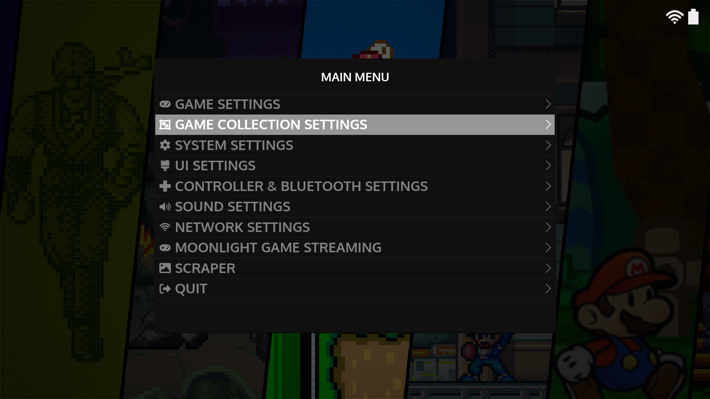

# :material-collage: Collections

In addition to the systems displayed; EmulationStation (ES) has functionality to create custom collections that you can use to group and organize your game library in different ways.  For example; if you wanted to create a view that automatically grouped all of your Role Playing Games you can use ES collections to do that. 

All of the options described below can be managed by pressing ++"START"++ anywhere in ES to open the Main Menu and then opening ++"Game Collection Settings"++

## Collection Types

There are 3 collection types in ES so let's walk through each to help you decide which makes sense to use for your use cases.

### Automated Collections

TBA

### Editable Collections

TBA

### Managing Your Backlog

TBA

### Dynamic Collections

TBA

---

## Additional Notes

You can also use the ++"Game Collection Settings"++ menu to manage which systems are displayed. Press ++"START"++ anywhere in ES to open the Main Menu and then go to ++"Game Collection Settings"++ > ++"Systems Displayed"++.  In this menu; uncheck the systems you would like to hide and then exit the menu.  ES will then refresh and those systems will be hidden.