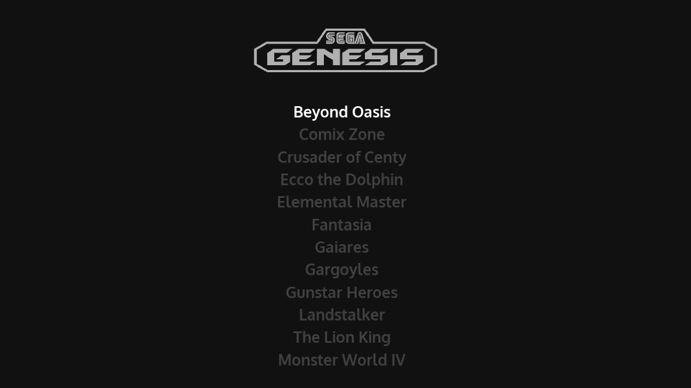
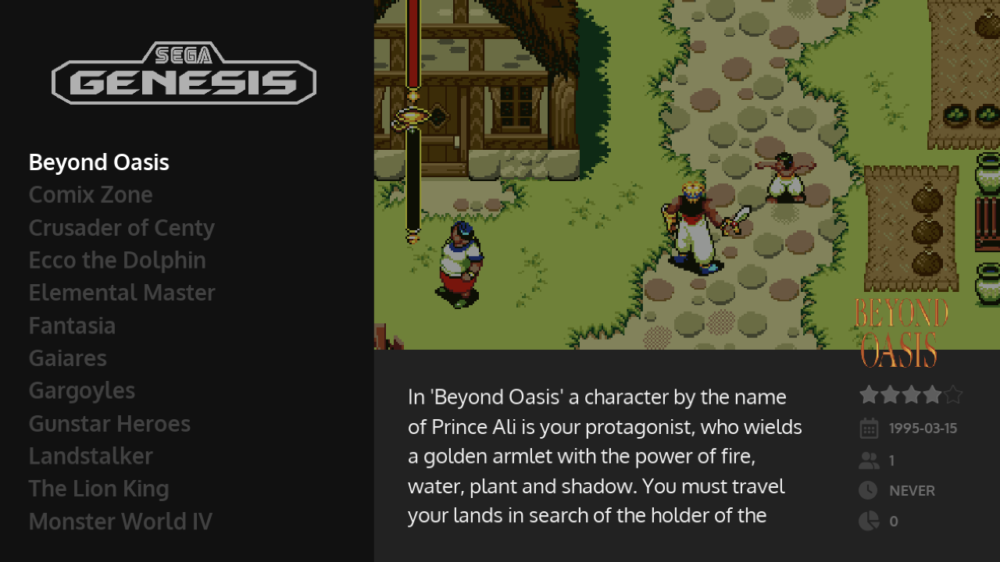

# :fontawesome-solid-photo-film: Scraping

Scraping allows you to download metadata, images and videos for your games, as well as manuals and sometimes even game maps.

| From this... | To this... |
| -- | -- |
| {data-description="Gamelist Before Scraping"} | {data-description="Gamelist After Scraping"} |

To scrape games, your deivce needs an internet connection, and you’ll also need to create to create an account on [ScreenScraper](https://screenscraper.fr/). 

Once you have created a ScreenScraper account:

1. Press ++"Start"++ to access the Main Menu, then go to Scraper. 
2. Enter your ScreenScraper username and password in the Username and Password fields. 
3. Using the checkboxes, select which resources you want to download when scraping (Preview images are downloaded automatically, and so are the game’s title, release date, developer, etc)

Please see our [Recommended Configurations](../themes/#recommended-configurations) for options that we believe work well with our default theme.