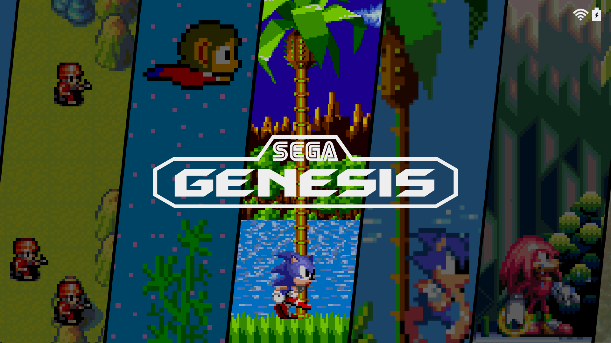
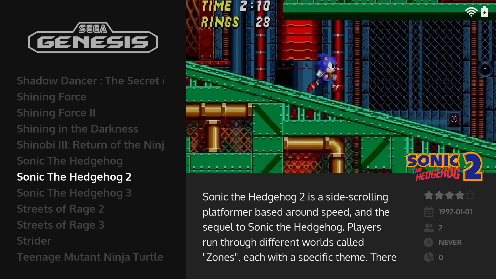

# :material-page-next-outline: Themes

Our default frontend is EmulationStation and our default theme is [Art Book Next](https://github.com/anthonycaccese/art-book-next-jelos) (which has been designed specifically to work with all the aspect ratios we support).  You will see it represented in the UI as `system-theme` and it's updated automatically as part of each JELOS release.  It also offers a set of options to tailor the look of theme which are detailed below.

## Preview

<table>
  <tr>
    <td></td>
    <td></td>
  </tr>
  <tr>
    <td></td>
    <td></td>
  </tr>
</table>

## Theme Configuration

The following options can be changed directly from the main menu under `UI Settings > Theme Configuration`

| Option | Description |
| -- | -- |
| Distribution | Used to define which folder to look in for Theme Customization files.  For JELOS installs this defaults to `JELOS` so please leave it as such |
| Aspect Ratio | Enables you to select the correct aspect ratio for your screen.  JELOS supports 16:9, 4:3, 16:10, 5:3, 3:2 and 1:1 aspect ratios.  We default this automatically so you should not need to change it but if the theme layout looks odd or spacing looks incorrect you can use this setting to make sure the aspect ratio matches your screen. |
| Color Scheme | Sets the color scheme that is used for the theme.  There is a set of prebuilt color schemes that you can select and an option to supply your custom color scheme (selected by choosing `custom`).  You can see details on customizations below under [Theme Customziations](#theme-customizations). |
| Fonts | When this is set to custom it allows you to define custom font sizes for the gamelist.  You can see details on customizations below under [Theme Customziations](#theme-customizations). |
| System View Style | Defines the layout/design used for the System View |
| Gamelist View Style | Defines the layout/design used for the Gamelist View |

### Recommended Configurations

#### Option 1: If you prefer Screenshots

| Setting | Value |
| -- | -- |
| Scraper: Image Source | `Screenshot` |
| Scraper: Box Source | `Box 2D` |
| Scraper: Logo Source | `Wheel` |
| Theme Configuration: Gamelist View Style | `Metadata On (Immersive)` or   `Metadata Off (Immersive)` |

#### Option 2: If you prefer Boxart

| Setting | Value |
| -- | -- |
| Scraper: Image Source | `Box 2D` |
| Scraper: Box Source | `None` |
| Scraper: Logo Source | `Wheel` |
| Theme Configuration: Gamelist View Style | `Metadata On` |

## Theme Customizations

Art Book Next allows customizations to artwork, colors and fonts without the need to edit the source XML.  This enables you to change the look of the theme and retain any changes when JELOS is updated.

### Start Here 
- Create the following path on your storage device: `~/roms/jelos/theme-customizations/art-book-next/`
- In Theme Configuration make sure distribution is set to `JELOS` (this is needed to make sure the above path is referenced when looking for customization files)

### Background Art

The artwork used on the system view can be customized with your own images.  You can create either `centered` or `full screen` variations.

- Create a folder in the path you created above called `backgrounds`
- Upload your custom background images to that folder
- They can be named:
    - _default.jpg
    - _default.png
    - ${system.theme}.jpg
    - ${system.theme}.png
- The theme will look them them up in that order.  If a given image is not found in your folder then the the images from the theme will be used as a fallback.  This allows you to customize only the images you want and still have images displayed for all systems.
- `_default.jpg/png` can be used for creating a single image that is used for all systems OR a fallback for systems that you did not create a custom image for (if you don't want to use the fallback that already exists in the theme)
- `${system.theme}.jpg/png` should be named for the system you are looking to override.  For example if you wanted to override the artwork for `snes` you would create an image called `snes.jpg` or `snes.png` in the backgrounds folder
- once your images are in place you turn on custom images by changing the System View Style to either... 
    - Centered Artwork (Custom)
    - Multi Artwork (Custom)
    - Fullscreen Artwork (Custom)
    - *I added these options so you could switch off custom artwork without needing to delete your customizations*

To create `centered` artwork that matches the mask used in the theme you can use the `system-art-mask` files I supply in the theme's resources directory [here](https://github.com/anthonycaccese/art-book-next-jelos/tree/main/resources/customizations).  I have tried to include a mask that works in the major editing programs.

If you create a set of images that you would like to share with the community please let us know about it in the themes channel on [Discord](https://discord.gg/seTxckZjJy)

### Logos

The logos used on the system and gamelist views can be customized with your own images.

- Create a folder in the path you created above called `logos`
- Upload your custom logo images to that folder
- They can be named:
    - ${system.theme}.svg
    - ${system.theme}.png
- The theme will look them them up in that order.  I recommend SVGs as they scale better on different resolutions.
- `${system.theme}.svg/png` should be named for the system you are looking to override.  For example if you wanted to override the artwork for `snes` you would create an image called `snes.svg` or `snes.png` in the logos folder

### Color Schemes

You can create your own custom color scheme to use for the theme

- Download this template: https://github.com/anthonycaccese/art-book-next-jelos/blob/main/resources/customizations/colors.xml
- Upload it in the path you created above and make sure its called `colors.xml`
- Change any values in the template to the colors you prefer.  
- I tried to make the values as self explanatory as possible but if you have questions regarding which property does what please don't hesitate to ask.
- After your colors are defined; in theme configuration change `Color Scheme` to `Custom`

### Fonts

You can modify the font size used to display gamelists

- Download this template: https://github.com/anthonycaccese/art-book-next-jelos/blob/main/resources/customizations/fonts.xml
- Upload it in the path you created above and make sure its called `fonts.xml`
- Change any values in the above template to the sizes you like. 
- After your sizes are defined; in theme configuration change `Fonts` to `Custom`

## Adding Additional Themes

You can upload additional themes to your device at this path: `/storage/.emulationstation/themes`

Below are a few sources for themes that may work.

### Option 1: Batocera Themes

- Our version of EmulationStation is forked from the same version used in Batocera so you can also use themes that were created for Batocera.
- You can find a list of Batocera themes here: [https://batocera.org/themes.php](https://batocera.org/themes.php)

!!! note "There are no guarantees that themes from the above list will support the aspect ratio of your device or all of the systems we support.  Because of that; some themes may look odd, not display all systems or have layouts that do not match well to your screen."

### Option 2: Community Created Themes

Members of our Community create themes as well.  This list is not exhaustive but here are a few that have been shared on discord that are known to work well:

- [es-theme-gbz35-jelos](https://github.com/booYah187/es-theme-gbz35-jelos) by booYah187: Known to work well on 4:3 aspect ratio
- [es-theme-albedo](https://github.com/mluizvitor/es-theme-albedo) by mluizvitor: Known to work well on 3:2, 4:3 and 5:3 aspect ratios
- [es-theme-elementerial](https://github.com/mluizvitor/es-theme-elementerial) by mluizvitor: Known to work well on 3:2, 4:3 and 5:3 aspect ratios

## Creating Your Own Theme

An exhaustive tutorial is out of scope for this wiki.  That said; please see Batocera's theme documention @ [https://wiki.batocera.org/write_themes_for_emulationstation](https://wiki.batocera.org/write_themes_for_emulationstation).  Its a great starter guide for understanding the fundamentals of creating themes for the version of EmulationStation used by JELOS.