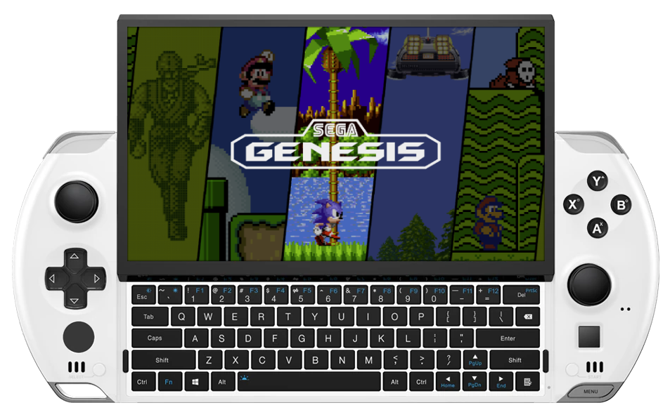

# GPDWin 4

{ .off-glb }

## Overview

| Device | CPU / Architecture | Kernel | GL driver | Interface |
| -- | -- | -- | -- | -- |
| Win 4 | Amd Ryzen 7 6800U / (x86_64) | Mainline Linux | Radeonsi | Weston + Emulation Station |

## Features

| Feature&nbsp;&nbsp;&nbsp;&nbsp;&nbsp;&nbsp;&nbsp;&nbsp;&nbsp;&nbsp;&nbsp;&nbsp;&nbsp;&nbsp;&nbsp;&nbsp; | Notes |
| -- | -- |
| :material-harddisk: Storage | JELOS can be run from an SD Card, USB Drive or installed directly to the internal NVME.   When installed directly to the NVME; an SD Card can be used for game storage. |
| :material-wifi: Wifi | Can be turned on in Emulation Station under Main Menu > Network |
| :simple-bluetooth: Bluetooth | Supports bluetooth audio and controllers |
| :material-fan: Fan | Can be set globally, per system or per game. |
| :material-lightning-bolt-circle: TPD Limit | Can be set globally, per system or per game. |
| :material-vibrate: Rumble | Enables the device rumble motor in emulators that support it. |

## Notes

### Installation

Download the latest `AMD64` version of JELOS from the button below and follow the instructions listed on the [Install](../../../play/install/) page.

### Booting from an SD Card

In order to launch JELOS from an SD card or a USB drive you will need to first change the boot order in the BIOS.  

During boot you can enter the bios by either pressing the `del` key on the built-in keyboard.  

In the bios; navigate to the `Boot` menu and then change the boot order to prioritize the SD card under `Boot Order Priorities`. Then go `Save & Exit` and select the Save Changes and Exit option.  This change will persist through all reboots.  If you want to boot into Windows simply remove the SD Card or USB drive.

## Additional References

- [Platform Documentation (AMD64)](https://github.com/JustEnoughLinuxOS/distribution/blob/main/documentation/PER_DEVICE_DOCUMENTATION/AMD64)
- [Panel Rotation](https://github.com/JustEnoughLinuxOS/distribution/blob/main/packages/kernel/linux/patches/AMD64/002-display-quirks.patch)