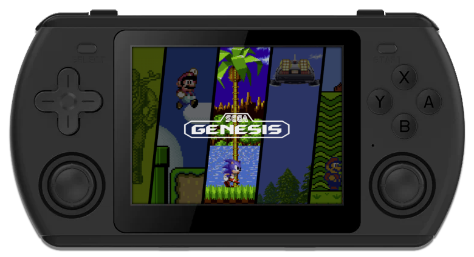

# Powkiddy RK2023

{ .off-glb }

## Overview

| Device | CPU / Architecture | Kernel | GL driver | Interface |
| -- | -- | -- | -- | -- |
| RK2023 | Rockchip RK3566 (ARM) | Rockchip BSP 4.19 | Mali | KMS/DRM + Emulation Station |

## Features

| Feature&nbsp;&nbsp;&nbsp;&nbsp;&nbsp;&nbsp;&nbsp;&nbsp;&nbsp;&nbsp;&nbsp;&nbsp;&nbsp;&nbsp;&nbsp;&nbsp; | Notes |
| -- | -- |
| :material-harddisk: Storage | JELOS can be run from an SD Card and an second SD card can be used to store games |
| :material-wifi: Wifi | Can be turned on in Emulation Station under Main Menu > Network Settings |
| :simple-bluetooth: Bluetooth | Supports bluetooth audio and controllers |

## Notes

### Installation

Download the latest `RK3566` version of JELOS from the button below and follow the instructions listed on the [Install](../../../play/install/) page.

## Additional References

- [Platform Documentation (RK3566)](https://github.com/JustEnoughLinuxOS/distribution/blob/main/documentation/PER_DEVICE_DOCUMENTATION/RK3566)

## Community Videos

| <iframe width="560" height="315" src="https://www.youtube.com/embed/p54gKqePMjE?si=EmdWdA0XmzCyMT2h&amp;start=316" title="YouTube video player" frameborder="0" allow="accelerometer; autoplay; clipboard-write; encrypted-media; gyroscope; picture-in-picture; web-share" allowfullscreen></iframe> | <iframe width="560" height="315" src="https://www.youtube.com/embed/rUSqHqgeXNY?si=Y4hNlAQGliuqrPi6&amp;start=316" title="YouTube video player" frameborder="0" allow="accelerometer; autoplay; clipboard-write; encrypted-media; gyroscope; picture-in-picture; web-share" allowfullscreen></iframe> |
| -- | -- |
| <iframe width="560" height="315" src="https://www.youtube.com/embed/T4js58Xl3b8?si=q4JCUw6WUEUI8wCD&amp;start=316" title="YouTube video player" frameborder="0" allow="accelerometer; autoplay; clipboard-write; encrypted-media; gyroscope; picture-in-picture; web-share" allowfullscreen></iframe> | <iframe width="560" height="315" src="https://www.youtube.com/embed/j49suAiYls8?si=whwZKpxRCjCd7O5-&amp;start=316" title="YouTube video player" frameborder="0" allow="accelerometer; autoplay; clipboard-write; encrypted-media; gyroscope; picture-in-picture; web-share" allowfullscreen></iframe> |
| <iframe width="560" height="315" src="https://www.youtube.com/embed/MYBH3o3hDIc?si=U4qNZ-FYBhMt7RQh&amp;start=316" title="YouTube video player" frameborder="0" allow="accelerometer; autoplay; clipboard-write; encrypted-media; gyroscope; picture-in-picture; web-share" allowfullscreen></iframe> | <iframe width="560" height="315" src="https://www.youtube.com/embed/2dUEGj2GAuA?si=M1B9R1gcAot4mMFW&amp;start=316" title="YouTube video player" frameborder="0" allow="accelerometer; autoplay; clipboard-write; encrypted-media; gyroscope; picture-in-picture; web-share" allowfullscreen></iframe> |
