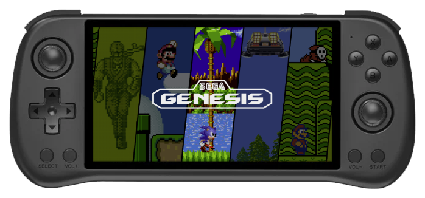

# Powkiddy x55

{ .off-glb }

## Overview

| Device | CPU / Architecture | Kernel | GL driver | Interface |
| -- | -- | -- | -- | -- |
| x55 | Rockchip RK3566 (ARM) | Rockchip BSP 4.19 | Mali | KMS/DRM + Emulation Station |

## Features

| Feature&nbsp;&nbsp;&nbsp;&nbsp;&nbsp;&nbsp;&nbsp;&nbsp;&nbsp;&nbsp;&nbsp;&nbsp;&nbsp;&nbsp;&nbsp;&nbsp; | Notes |
| -- | -- |
| :material-harddisk: Storage | JELOS can be installed to the emmc or run from an SD Card, and an second SD card can be used to store games |
| :material-wifi: Wifi | Can be turned on in Emulation Station under Main Menu > Network Settings |
| :simple-bluetooth: Bluetooth | Supports bluetooth audio and controllers |

## Controls





















## Emulators

- [Platform Documentation (RK3566)](https://github.com/JustEnoughLinuxOS/distribution/blob/main/documentation/PER_DEVICE_DOCUMENTATION/RK3566)

## Notes

### Installation

Download the latest `RK3566-X55` version of JELOS from the button below and follow the instructions listed on the [Install](../../../play/install/) page.

### Community Videos

| <iframe width="560" height="315" src="https://www.youtube.com/embed/GRWvXiwTn-w?si=jelKwX3yJ8irIp6N&amp;start=1008" title="YouTube video player" frameborder="0" allow="accelerometer; autoplay; clipboard-write; encrypted-media; gyroscope; picture-in-picture; web-share" allowfullscreen></iframe> | <iframe width="560" height="315" src="https://www.youtube.com/embed/QVLHJt-zdsM?si=RgcjLIcc1BTqr_vU&amp;start=312" title="YouTube video player" frameborder="0" allow="accelerometer; autoplay; clipboard-write; encrypted-media; gyroscope; picture-in-picture; web-share" allowfullscreen></iframe> |
| -- | -- |
| <iframe width="560" height="315" src="https://www.youtube.com/embed/jl8Lj9ui1Vk?si=RD6t719_eBcqDKjB&amp;start=316" title="YouTube video player" frameborder="0" allow="accelerometer; autoplay; clipboard-write; encrypted-media; gyroscope; picture-in-picture; web-share" allowfullscreen></iframe> | <iframe width="560" height="315" src="https://www.youtube.com/embed/GSAxLByHYNs?si=XbuGzEwzVw6fROxY&amp;start=316" title="YouTube video player" frameborder="0" allow="accelerometer; autoplay; clipboard-write; encrypted-media; gyroscope; picture-in-picture; web-share" allowfullscreen></iframe> |
| <iframe width="560" height="315" src="https://www.youtube.com/embed/74gGVUmnvhg?si=hovBY8QrPDEK-do6&amp;start=316" title="YouTube video player" frameborder="0" allow="accelerometer; autoplay; clipboard-write; encrypted-media; gyroscope; picture-in-picture; web-share" allowfullscreen></iframe> |
