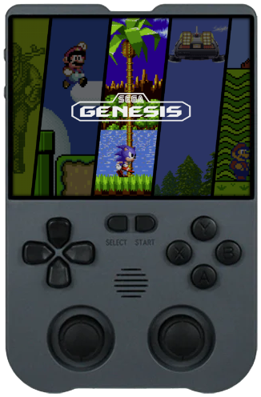

---
search:
  exclude: true
---
# Powkiddy XU10

{ .off-glb }

## Overview

| CPU / Architecture | Kernel | GL driver | Interface |
| -- | -- | -- | -- |
| Rockchip RK3326 (ARM) | Mainline Linux | Panfrost | Weston + Emulation Station |

## Features

| Feature&nbsp;&nbsp;&nbsp;&nbsp;&nbsp;&nbsp;&nbsp;&nbsp;&nbsp;&nbsp;&nbsp;&nbsp;&nbsp;&nbsp;&nbsp;&nbsp; | Notes |
| -- | -- |
| :material-wifi: Wifi | Can be turned on in Emulation Station under Main Menu > Network Settings |

## Emulators

- [Platform Documentation (RK3326)](https://github.com/JustEnoughLinuxOS/distribution/blob/main/documentation/PER_DEVICE_DOCUMENTATION/RK3326)

## Notes

### Installation

Download the latest `RK3326` version of JELOS from the button below and follow the instructions listed on the [Install](../../../play/install/) page.

