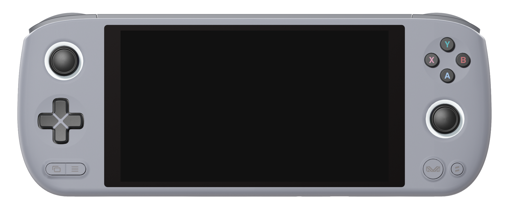

  
  <video autoplay loop muted><source src="_inc/video/preview.mp4" type="video/mp4"></video>

# Welcome to the JELOS Wiki :material-gamepad:

   
   

Just Enough Linux Operating System (JELOS) is an immutable Linux distribution for handheld gaming devices focused on retro gaming emulation.  It is developed by a small community of enthusiasts and our goal is to produce an operating system that has the features and capabilities we need and to have fun as we develop it.

## Features

- Integrated cross-device local and remote network play.
- In-game touch support on supported devices.
- Fine grain control for battery life or performance.
- Includes support for playing Music and Video.
- Bluetooth audio and controller support.
- Support for HDMI audio and video out, and USB audio.
- Device to device and device to cloud sync with Syncthing and rclone.
- VPN support with Wireguard, Tailscale, and ZeroTier.
- Includes built-in support for scraping and retroachievements.

## Preview

<table>
  <tr>
    <td></td>
    <td></td>
  </tr>
  <tr>
    <td></td>
    <td></td>
  </tr>
</table>

## Community

The JELOS community utilizes Discord for discussion, if you would like to join us please use this link: &nbsp;[:simple-discord: Discord](https://discord.gg/seTxckZjJy)

## Licenses

JELOS is a Linux distribution that is made up of many open-source components.  Components are provided under their respective licenses.  This distribution includes components licensed for non-commercial use only.

### JELOS Branding

JELOS branding and images are licensed under a [Creative Commons Attribution-NonCommercial-ShareAlike 4.0 International License](https://creativecommons.org/licenses/by-nc-sa/4.0/).

You are free to:

- Share: copy and redistribute the material in any medium or format
- Adapt: remix, transform, and build upon the material

Under the following terms:

- Attribution: You must give appropriate credit, provide a link to the license, and indicate if changes were made. You may do so in any reasonable manner, but not in any way that suggests the licensor endorses you or your use.
- NonCommercial: You may not use the material for commercial purposes.
- ShareAlike: If you remix, transform, or build upon the material, you must distribute your contributions under the same license as the original.

### JELOS Software

Copyright 2023 JELOS (https://github.com/JustEnoughLinuxOS)

Original software and scripts developed by the JELOS team are licensed under the terms of the [GNU GPL Version 2](https://choosealicense.com/licenses/gpl-2.0/).  The full license can be found in this project's licenses folder.

### Bundled Works
All other software is provided under each component's respective license.  These licenses can be found in the software sources or in this project's licenses folder.  Modifications to bundled software and scripts by the JELOS team are licensed under the terms of the software being modified.

## Credits

Like any Linux distribution, this project is not the work of one person.  It is the work of many persons all over the world who have developed the open source bits without which this project could not exist.  Special thanks to CoreELEC, LibreELEC, and to developers and contributors across the open source community.
