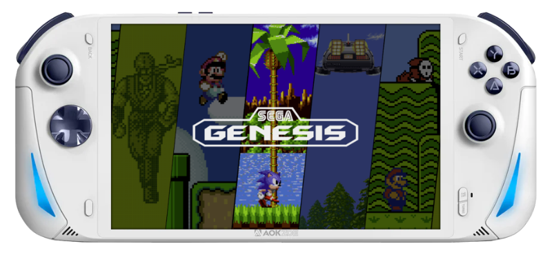

# AOKZOE A1 Pro

{ .off-glb }

## Overview

| Device | CPU / Architecture | Kernel | GL driver | Interface |
| -- | -- | -- | -- | -- |
| A1 Pro | AMD 7840u (x86_64) | Mainline Linux | Radeonsi | Weston + Emulation Station |

## Notes

| DMI_SYS_VENDOR | DMI_PRODUCT_NAME |
| -- | -- |
| `AOKZOE` | `AOKZOE A1 Pro` |

### Installation

Download the latest `AMD64` version of JELOS from the button below and follow the instructions listed on the [Install](../../../play/install/) page.

## Additional References

- [Platform Documentation (AMD64)](https://github.com/JustEnoughLinuxOS/distribution/blob/main/documentation/PER_DEVICE_DOCUMENTATION/AMD64)
- [Panel Rotation](https://github.com/JustEnoughLinuxOS/distribution/blob/main/packages/kernel/linux/patches/AMD64/002-display-quirks.patch)