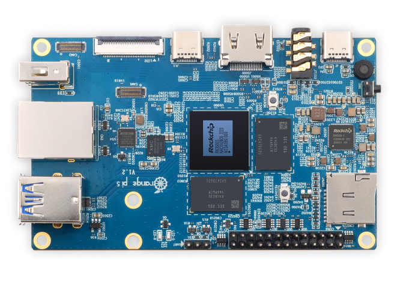

# Orange Pi 5

{ .off-glb }

## Overview

| Device | CPU / Architecture | Kernel | GL driver | Interface |
| -- | -- | -- | -- | -- |
| Orange Pi 5 | Rockchip RK3588S / Mali G610 (ARMv8-A) | Rockchip 5.10 BSP Linux | Panfrost | Weston + EmulationStation |

## Additional References

- [Platform Documentation (RK3588)](https://github.com/JustEnoughLinuxOS/distribution/blob/main/documentation/PER_DEVICE_DOCUMENTATION/RK3588)

